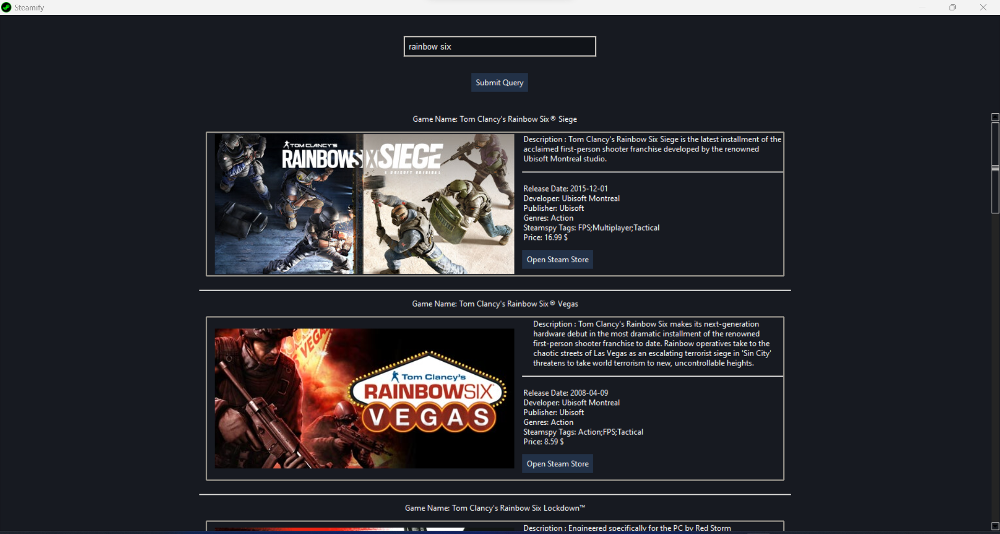

# Data Download and Information Retrieval

Welcome to the data download and information retrieval section. Below, you'll find links to download the datasets used in this project.

## Datasets

1. [Dataset](https://www.kaggle.com/datasets/nikdavis/steam-store-games)
   - Description: This dataset contains [Steam Games Data Set].

## Demo



## Instructions

1. Click on the link to download the datasets.
2. Extract the downloaded ZIP files to access the dataset files.
3. Copy All CSV Data To `data/csv/` Folder.
4. Install project dependencies using the following command:

   ```bash
   pip install -r requirements.txt
   ```
   ```bash
   python -m spacy download en_core_web_sm
   ```

5. Run the app using the following command:

   ```bash
   python main.py
   ```

   